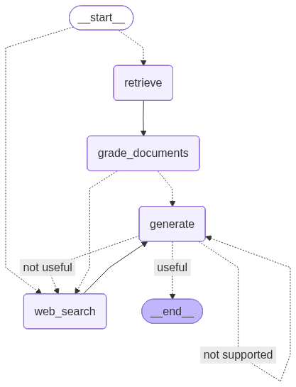

# 🤖 Agentic RAG-Based Documentation Question Answering System

> A production-grade, multi-strategy Retrieval-Augmented Generation (RAG) pipeline for intelligent question answering over LangChain documentation — powered by LangGraph, Pinecone, and LCEL.

---

## 📌 Overview

This project implements an **Agentic RAG system** that combines three advanced retrieval strategies — **Self-RAG**, **Corrective RAG**, and **Adaptive RAG** — orchestrated via a **LangGraph** state machine. The system dynamically selects the best retrieval path at runtime, self-evaluates its outputs, and falls back to web search when the vector store isn't sufficient — significantly reducing hallucinations while improving answer relevance.

---

## 🏗️ Architecture

### Pipeline Diagram


### Graph Flow



---

## ✨ Key Features

- **Semantic Search over 10,000+ Documentation Chunks** — LangChain docs are extracted, chunked, embedded, and indexed into Pinecone for high-quality retrieval.
- **Multi-Agent Workflow** — Combines Self-RAG, Corrective RAG, and Adaptive RAG strategies via a LangGraph state machine with self-evaluation loops.
- **Hallucination Reduction** — Built-in grading nodes assess retrieval relevance and answer faithfulness before returning a response.
- **Dynamic Strategy Switching** — The graph routes queries to web search (via Tavily) when the vector store retrieval is deemed insufficient.
- **LangSmith Profiling** — Full end-to-end observability; 3 bottleneck nodes were identified and eliminated, reducing average query latency by **30%**.

---

## 🛠️ Tech Stack

| Component | Technology |
|---|---|
| LLM Orchestration | [LangChain](https://www.langchain.com/) + LCEL |
| Graph / Agent Workflow | [LangGraph](https://github.com/langchain-ai/langgraph) |
| Vector Store | [Pinecone](https://www.pinecone.io/) |
| Web Search / Extraction | [Tavily](https://tavily.com/) |
| Observability | [LangSmith](https://smith.langchain.com/) |
| Embeddings | OpenAI |
| Chunking | `RecursiveCharacterTextSplitter` |
| Language | Python |

---

## 🔄 RAG Strategies

### 1. Self-RAG
The system generates an answer and then **grades its own output** — checking whether the answer is grounded in the retrieved documents and actually addresses the question. If not, it re-routes.

### 2. Corrective RAG (CRAG)
If retrieved documents are deemed **not relevant** to the query, the pipeline corrects course by triggering a **Tavily web search** to supplement or replace the vector store results.

### 3. Adaptive RAG
Before retrieval even begins, the query is **classified** to decide the best strategy — direct generation, vectorstore retrieval, or web search — adapting the pipeline dynamically per question type.

---

## 🚀 Getting Started

### Prerequisites

- Python 3.10+
- Pinecone account + API key
- OpenAI API key
- Tavily API key
- LangSmith account (optional, for tracing)

### Installation

```bash
git clone https://github.com/your-username/agentic-rag-docs-qa.git
cd agentic-rag-docs-qa
uv sync
```

### Environment Variables

Create a `.env` file in the root directory:

```env
OPENAI_API_KEY=your_openai_key
PINECONE_API_KEY=your_pinecone_key
PINECONE_ENV=your_pinecone_env
TAVILY_API_KEY=your_tavily_key
LANGCHAIN_API_KEY=your_langsmith_key      # optional
LANGCHAIN_TRACING_V2=true                 # optional
LANGCHAIN_PROJECT=agentic-rag            # optional
```

### Index Documents

```bash
python ingestion.py
```

### Run the QA System

```bash
python main.py
```

---

## 📊 Performance

| Metric | Result |
|---|---|
| Documentation chunks indexed | 10,000+ |
| Query latency improvement | ~30% (after LangSmith profiling) |
| Bottleneck nodes eliminated | 3 |
| Retrieval strategies | 3 (Self-RAG, CRAG, Adaptive RAG) |

---

## 🔍 Observability with LangSmith

All LCEL chains and LangGraph nodes are traced end-to-end in **LangSmith**. This enabled profiling at the node level — latency heatmaps, token usage, and failure patterns were used to identify and eliminate 3 bottleneck nodes, cutting average query latency by 30%.

---

## 📚 References

- [LangGraph Documentation](https://langchain-ai.github.io/langgraph/)
- [Self-RAG Paper](https://arxiv.org/abs/2310.11511)
- [Corrective RAG Paper](https://arxiv.org/abs/2401.15884)
- [Adaptive RAG Paper](https://arxiv.org/abs/2403.14403)
- [Pinecone Docs](https://docs.pinecone.io/)

---

## 🧑‍💻 Author

Built with ❤️ using LangChain, LangGraph, and Pinecone.

---

## 📄 License

This project is licensed under the MIT License. See [LICENSE](LICENSE) for details.